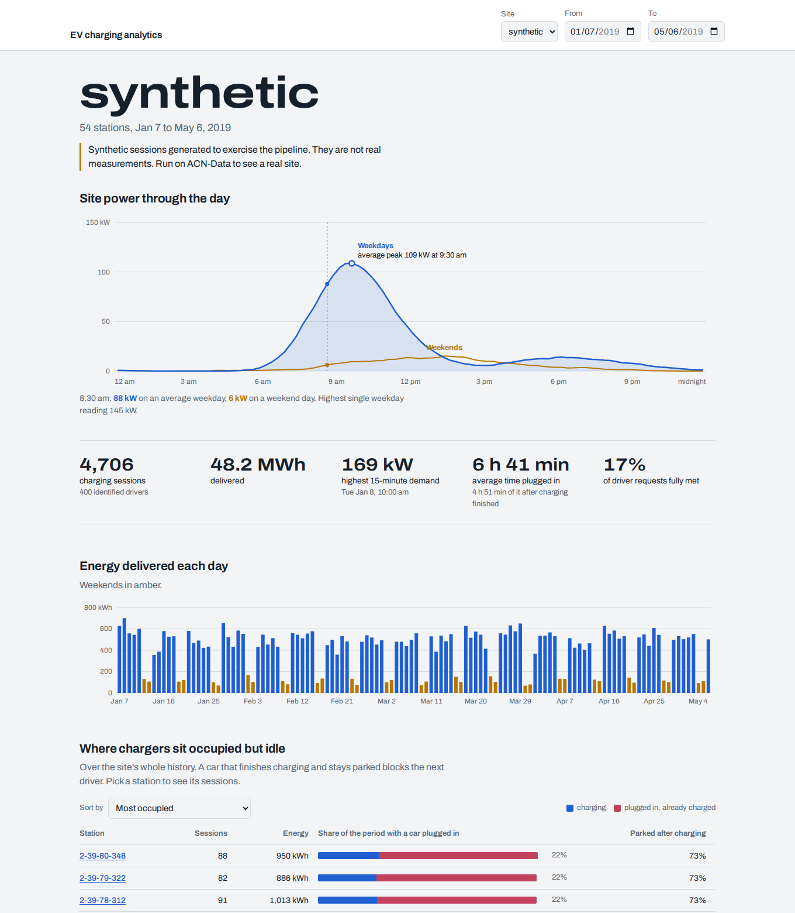
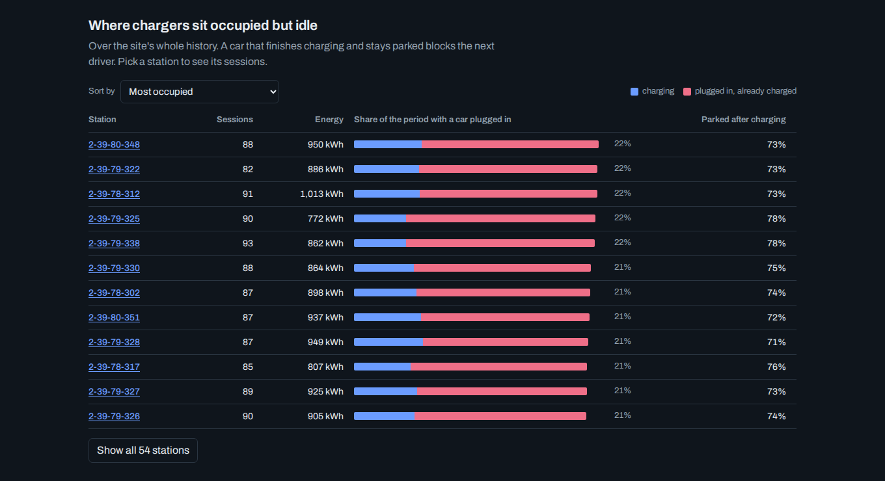
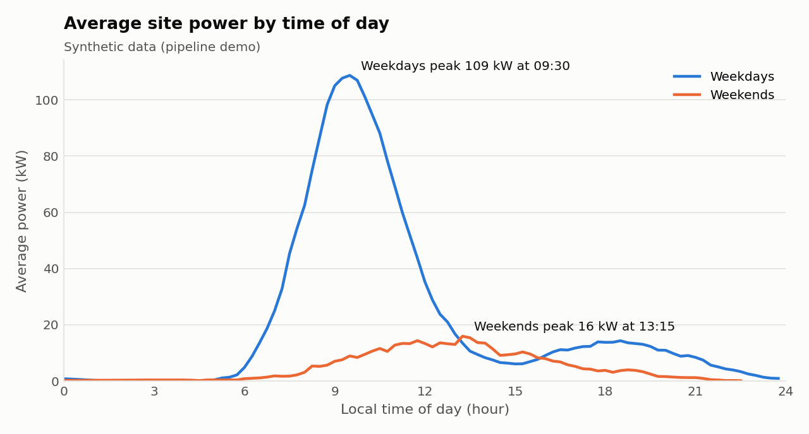
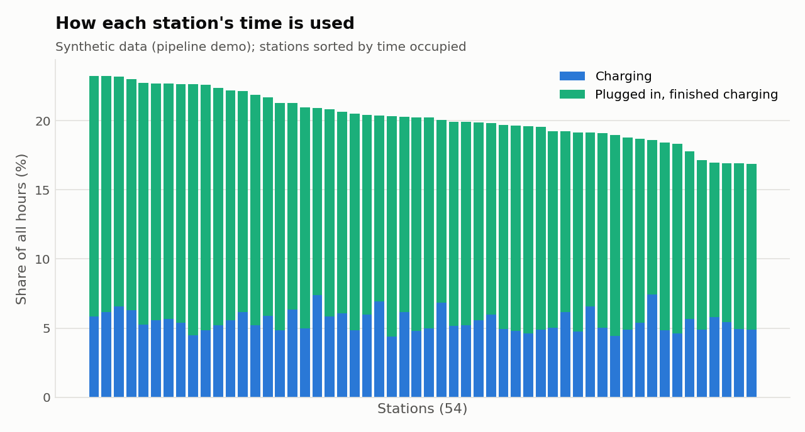
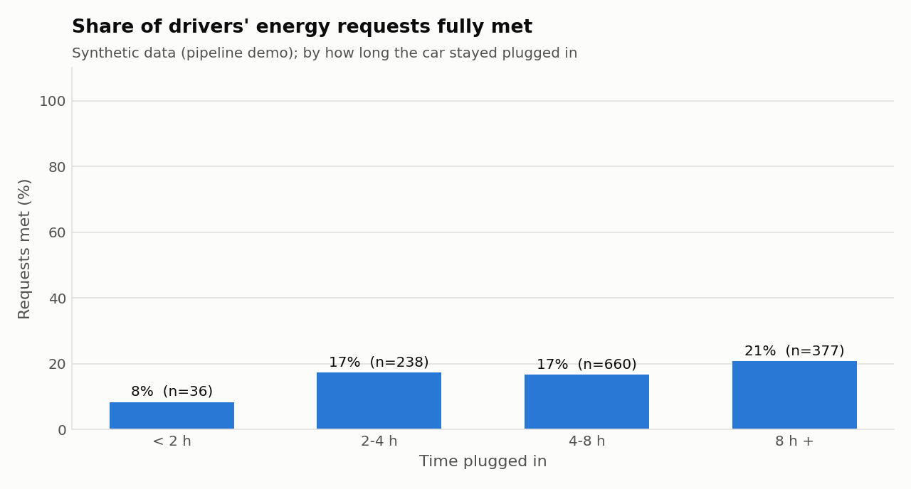

# EV Charging Analytics

An analytics platform for EV charging sessions from Caltech's public [ACN-Data](https://ev.caltech.edu/dataset) network. It covers:
- ingestion from the ACN-Data API, with validation and quarantine;
- dbt models on DuckDB, with data tests, including a 15-minute site load curve;
- orchestration with Airflow;
- a Postgres-backed REST API and a React + TypeScript web app for exploring how a site's chargers are actually used.

```
ACN-Data API ──► raw JSONL ──► ingest ──► bronze Parquet ──► dbt build (DuckDB) ──► report
                (immutable)     │          (valid rows)       staging → marts        charts + summary
                                └──► quarantine (bad rows + reason)   26 data tests
                                                                          │
                                                       evcharge publish   ▼
                                    React + TypeScript ◄── FastAPI ◄── Postgres (indexed marts)
                                    web app                REST API
                                                    Airflow: daily fetch → ingest → dbt build → report
```



## Questions it answers

- **When does the site draw the most power?** A 15-minute load curve built from session data, for demand-charge and capacity planning.
- **How much charger capacity is wasted?** For each station, the time spent charging versus the time occupied by a car that has already finished charging.
- **Do drivers get the energy they ask for?** The share of app requests fully met, by how long the car stayed plugged in.
- **Daily operations:** sessions, energy, drivers, plug-in durations and overstays, per site per day.

## Pipeline

| Stage | What it does |
|---|---|
| `evcharge fetch` | Pulls sessions from the ACN-Data API (token auth, pagination, retries with backoff) and writes them unchanged to `data/raw/<site>/*.jsonl`. A download only becomes visible when complete. |
| `evcharge ingest` | Flattens each record (keeping the driver's latest app request), validates it, drops duplicate session IDs and writes `data/bronze/sessions/<site>.parquet`. Rows that fail a rule go to `quarantine.parquet` with the reason instead of disappearing. Ingestion is rebuilt from raw each run, so it is idempotent. |
| `evcharge transform` | `dbt build`: one staging view and five mart tables, plus 26 data tests. |
| `evcharge report` | Three charts and a summary table from the marts. |

**Validity rules** (rows that break one are quarantined): disconnect before connect, negative energy, charging finished outside the session, average power above what Level-2 hardware can deliver, sessions longer than 72 hours.

### dbt models

| Model | Grain | Purpose |
|---|---|---|
| `stg_sessions` | session | Durations, local time, idle time, request fulfillment |
| `fct_charging_sessions` | session | Adds outcome flags: request met, overstayed |
| `dim_stations` | station | First and last use, sessions, energy |
| `agg_daily_site` | site × day | Sessions, energy, drivers, durations, service levels |
| `agg_station_utilization` | station | Shares of time occupied, charging and idle |
| `fct_site_load_15min` | site × 15 min | Power demand: each session's energy spread over its charging window |

**Data tests** include uniqueness and not-null keys, value ranges, `charging time ≤ plugged-in time`, `charging share ≤ occupied share`, and an **energy-conservation test**: the 15-minute load curve must add back up to the kWh actually delivered. Breaking the load model on purpose (losing 10% of energy) makes that test fail.

## Running it

```bash
pip install -e ".[dev]"

# everything at once: Postgres, the pipeline on synthetic data, the API and web app
docker compose up --build          # http://localhost:8000

# real data: free token from https://ev.caltech.edu/register
export ACN_API_TOKEN=...
evcharge fetch --site caltech --start 2019-01-01 --end 2019-07-01
evcharge run                      # ingest -> dbt build -> report into results/

# no token: synthetic sessions in the same raw format
evcharge run --synthetic --inject-issues
```

`--inject-issues` adds malformed and duplicate records, to show them being quarantined and dropped. Results go to `results/`; the DuckDB warehouse is `data/warehouse.duckdb`, which you can query directly:

```bash
duckdb data/warehouse.duckdb "select * from agg_daily_site order by local_date limit 10"
```

**Web app, locally:**

```bash
evcharge serve                     # API on :8000 (reads data/warehouse.duckdb, or Postgres if EVCHARGE_PG_DSN is set)
cd web && npm ci && npm run dev    # web app on :5173, proxying /api to :8000
```

**Airflow:** `dags/ev_charging_pipeline.py` runs fetch → ingest → dbt build → report daily for the previous day. A failed data test stops the run before the report is regenerated.

## Web app and API

`evcharge publish` copies the marts into Postgres. The data is loaded and indexed in a staging schema, and the staging schema replaces the live one in a single transaction, so the API never reads a half-loaded table. `evcharge serve` runs the FastAPI backend and serves the built web app at `/`.

| Endpoint | Returns |
|---|---|
| `GET /api/sites` | Each site with its timezone, date range, station count and totals |
| `GET /api/sites/{site}/summary` | Sessions, energy, peak 15-minute demand, plug-in and idle time, requests met, for a date range |
| `GET /api/sites/{site}/daily` | One row per day |
| `GET /api/sites/{site}/load-profile` | Average and peak power by time of day, weekdays vs weekends |
| `GET /api/sites/{site}/stations` | Occupied, charging and idle shares per station |
| `GET /api/sites/{site}/sessions` | Sessions newest first, with keyset (cursor) pagination and an optional station filter |

The web app's TypeScript types are generated from the API's OpenAPI schema (`npm run gen:api`). CI regenerates them and fails if they differ from the committed copy, so a backend change can't silently break the frontend. The app shows:
- the site's daily load curve with its weekday peak;
- headline figures;
- energy per day;
- a station table that shows how much plugged-in time is spent by cars that have already finished charging;
- the session log.

View state lives in the URL, so a view can be shared. Light and dark themes follow the system setting.



The same SQL runs on DuckDB (development, no setup) and Postgres (production). A test checks that every endpoint returns identical results on both.

### Query tuning

The session log is the heaviest query. On a 2.9-million-row table, page 200 of a site's year went from **249 ms to 0.23 ms** in three steps:
1. a composite index;
2. rewriting the date filter as a UTC range the index can use;
3. replacing OFFSET with keyset pagination.

The full write-up, with plans and buffer counts, is in [docs/QUERY_TUNING.md](docs/QUERY_TUNING.md). `evcharge bench` reproduces it.

## Example output

> ⚠️ **The images below come from the synthetic generator**, not real ACN-Data. They show what the pipeline produces; they are not findings. Real results are produced by `evcharge fetch` + `evcharge run`.





## Tests

```bash
pytest                                                     # Postgres tests skip without a database
EVCHARGE_TEST_PG_DSN=postgresql://... pytest              # all 30
cd web && npm test                                         # 7 web tests
```

The Python tests cover:
- timestamp parsing, flattening and the validity rules;
- ACN-Data API pagination and retries, against a fake HTTP client;
- the synthetic generator;
- ingestion: quarantine, dedupe across overlapping downloads, idempotency;
- the full pipeline end to end, including every dbt data test;
- the REST API: totals that agree across endpoints, a load profile that conserves energy, cursor paging that returns every session exactly once, and 404/422 errors;
- Postgres vs DuckDB parity;
- the benchmark's four query versions returning the same page.

The web tests cover formatting and scales, the load-curve annotation, station sorting and cursor paging in the session log. On every push, CI does the following:
- runs everything against a Postgres service;
- checks that the generated API types are current;
- type-checks and builds the web app;
- builds the Docker image.

## Design notes

- **Raw is immutable; bronze is rebuilt.** Re-running ingestion never double-counts, and a bug fix in validation can be applied to all history by re-ingesting.
- **Quarantine, not drop.** Bad records stay visible with a reason, so data issues can be counted and traced to their source file and line.
- **Load from session data.** The API also offers per-minute charging time series, which would give exact load. Spreading session energy evenly over the charging window is the standard approximation when only session records are available, and the conservation test guarantees no energy is lost or invented.
- **DuckDB + dbt.** The same models would run on a warehouse such as Snowflake or BigQuery by changing the dbt profile.
- **DuckDB to build, Postgres to serve.** DuckDB is fast on the full scans that building marts needs. The web app makes many small concurrent lookups, which want B-tree indexes and a server database.
- **Dates are local, filters are UTC.** A site's "March 10" is turned into a half-open UTC range in the site's timezone. That's correct across daylight-saving changes, and it lets every date filter use an index.

## Project layout

```
evcharge/
  sources/acn.py        ACN-Data API client
  sources/synthetic.py  synthetic sessions (same raw format)
  schema.py             flattening and validity rules
  ingest.py             raw -> bronze, quarantine, dedupe
  report.py             charts and summary
  serving/publish.py    marts -> Postgres (indexes, atomic swap)
  serving/store.py      queries for the API, on Postgres or DuckDB
  api.py                FastAPI app
  bench.py              query-tuning benchmark
  cli.py                evcharge command
dbt/                    staging and mart models, data tests
dags/                   Airflow DAG
web/                    React + TypeScript app (Vite), types generated from OpenAPI
tests/                  pytest suite
docs/QUERY_TUNING.md    session query tuning write-up
```

## Data

ACN-Data: Lee, Li and Low, *"ACN-Data: Analysis and Applications of an Open EV Charging Dataset"*, ACM e-Energy 2019. Data from the Caltech, JPL and office001 sites, available through the [ACN-Data API](https://ev.caltech.edu/dataset).
